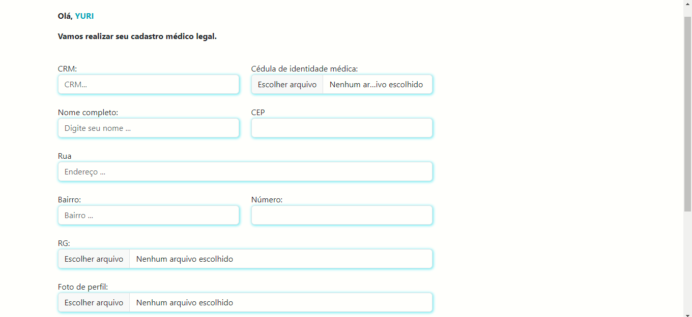

# 
<h1>:medical_symbol: CLINICA HEALING::medical_symbol:</h1>

 

  

___

# 
<h2> TELA DE CADASTRO </h2>

___

# 
<h2> TELA DE LOGIN </h2>

___

# 
<h2> TELA DE CADASTRO DO MÉDICO </h2>

___

# 
<h2> TELA DA ÁREA ADMINISTRATIVA </h2>

 
Desenvolvedores/Contribuintes :octocat:

| [ Yuri Nogueira Sampaio](https://github.com/YuriSampaio10)
| :---: |

